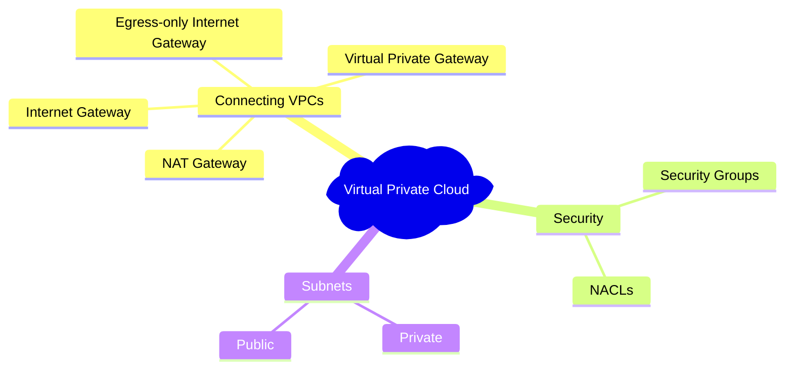

# Networking

## CloudFront
*CDN*

Uses AWS edge locations to deliver

### Uses
* Streaming videos
* Secure transactions
* Traffic spikes
* Analytics
* Static/dynamic content

## Global Accelerator

### Uses
* Global traffic manager
* *API* acceleration
* Global static IP
* Low-latency gaming/media workloads

## Virtual Private Cloud
A logically isolated virtual network defined by the user. Closely resembles a traditional network in a data center. 

AWS resources are automatically provisioned within a default VPC.

### Uses
* Hybrid connections
* Hosting multi-tier web applications

### Features
* Provides full control of:
    * Resource placement
    * Connectivity
    * Security
    * Communication between *VPC*s (across accounts, *AZ*s/regions)
* *Route table*
* *NACL*
    * Rules to determine network traffic by allowing or denying access to specific resources (IP addresses, protocols, ports).
* Direct Connect (Hybrid Connections)
    * Large scale data transfer, consistent performance, good for sensitive data
* Supports 1 primary and 4 secondary IPv4 address ranges.
    * Can be between /28 (CIDR notation) and /16 in size.

#### VPC Subnets
A range of IP addresses within the VPC. Can be public or private.

#### Gateways
* *Internet Gateway*
* *NAT Gateway*
* *Virtual Private Gateway*
* *Egress-only Internet Gateway*

#### Peering Connection
A VPC peering connection is a networking connection between two VPCs that enables you to route traffic between them using private IPv4 addresses or IPv6 addresses.

Can peer between 2 VPCs in the same account, or another AWS account.

#### VPC Endpoints
A way to connect to AWS services powered by AWS PrivateLink.

### Security
There are two distinct approaches to securing inbound/outbound traffic.

* *Security groups*
    * Applied at instance level to all security group members.
    * Allow rules only
    * Stateful, allowing return traffic automatically.
* Network ACL (*NACL*)
    * Applied at subnet level to all associated instances.
    * Allow and deny rules
    * Stateless, return traffic must be explicitly allowed.

### Diagram

## Route 53
Amazon's DNS service. Create and manage public DNS records, as well as configuring user request routing to resources within AWS and externally.

### Features

#### *Hosted Zones*
Each Route 53 account is limited to 500 *hosted zones* and 10,000 resource record sets per hosted zone.

#### Routing Policies
* Weighted Round Robin
    * Assign weights to resource record sets to determine frequency.
    * Often used for A/B testing.
* Latency Based Routing 
    * Route users to the AWS region with lowest latency
* Geo DNS 
    * Direct requests to specific endpoints based on geographic location

#### Traffic Flow
Global traffic management service. Developers can create policies to route traffic based on numerous constraints:

* Latency
* Endpoint health
* Load
* Geoproximity
* Geography

#### Private DNS
Control DNS within VPCs without exposing DNS records to the Internet.

## Direct Connect
Links your internal network to an AWS Direct Connect location using a Ethernet fiber cable. 

Has a selection of dedicated (1/10/100/400Gbps single customer port) or hosted (sourced from AWS Direct Connect Partner) connections.

## Elastic Load Balancing
Automatically distribute incoming application traffic across multiple targets/virtual appliances in one or more AZs.

### Load Balancer Types

* Application Load Balancer
    * HTTP Requests
* Network Load Balancer
    * Network/transport protocols (layer 4)
* Classic Load Balancer
    * Applications built with EC2
* Gateway Load Balancer
    * Third-party virtual appliances

